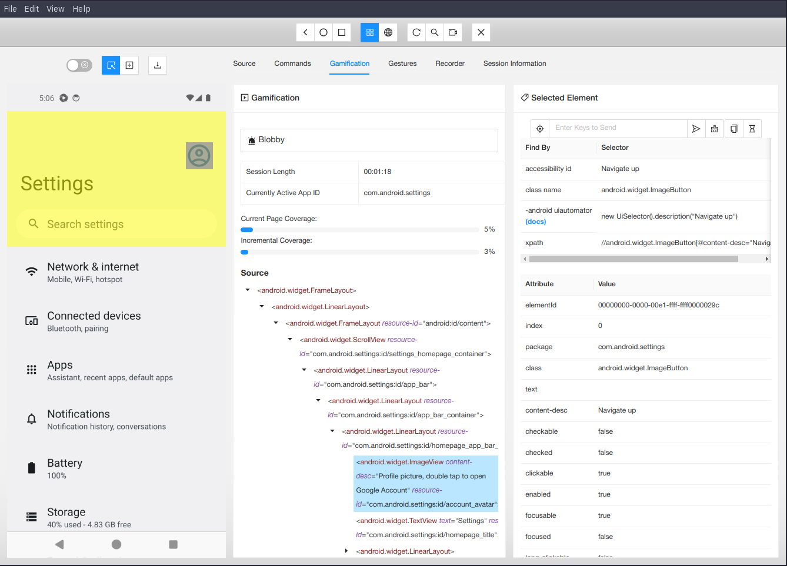

# GAppium Inspector

   Gamified GUI Inspector tool for all kinds of apps, powered by Appium.

Appium Inspector is a GUI assistant tool for Appium, providing visual inspection of the application
under test. It can show the application page screenshot along with its page source, and includes
various features for interacting with the app.

This specific version features an extension which integrates some
gamification components, like a progress bar and a customizable user
name.

---

<b>
   <a href="https://appium.github.io/appium-inspector/">Documentation</a> |
   <a href="https://appium.github.io/appium-inspector/latest/quickstart/">Get Started</a> |
   <a href="https://discuss.appium.io">Discussion Forum</a> |
   <a href="https://crowdin.com/project/appium-desktop">Help with Translations</a>
</b>

---

## Usage

**Note**: this assumes you have a running instance of the Appium
server in background.

You can run Appium Inspector in development mode with `npm run
dev:electron`.

## Features

The Inspector has many features in addition to its app inspection abilities:

- Specify the Appium server details
- Interact with the app screenshot
- Search for elements and interact with them
- Run Appium driver commands
- and more...

Check the [Features documentation](https://appium.github.io/appium-inspector/latest/overview/#features-overview)
for a more comprehensive list!

